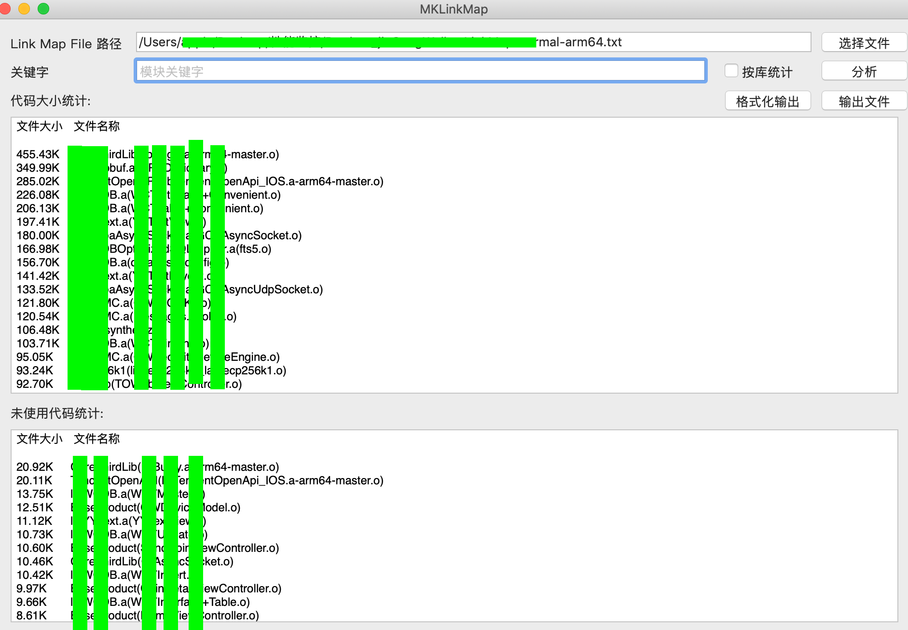
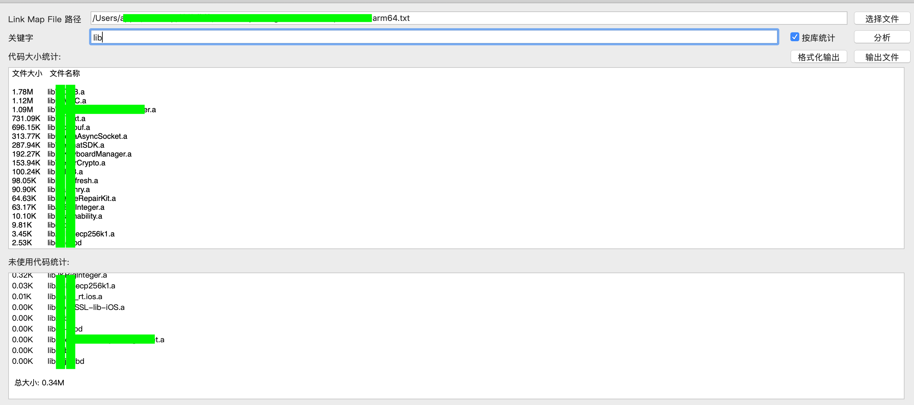
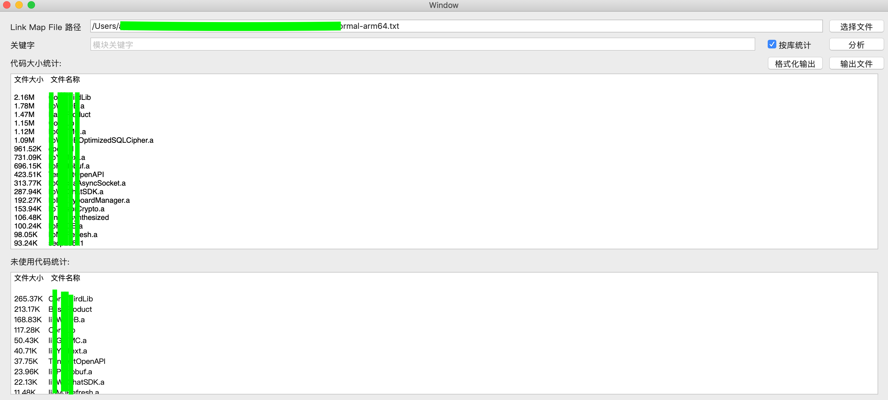
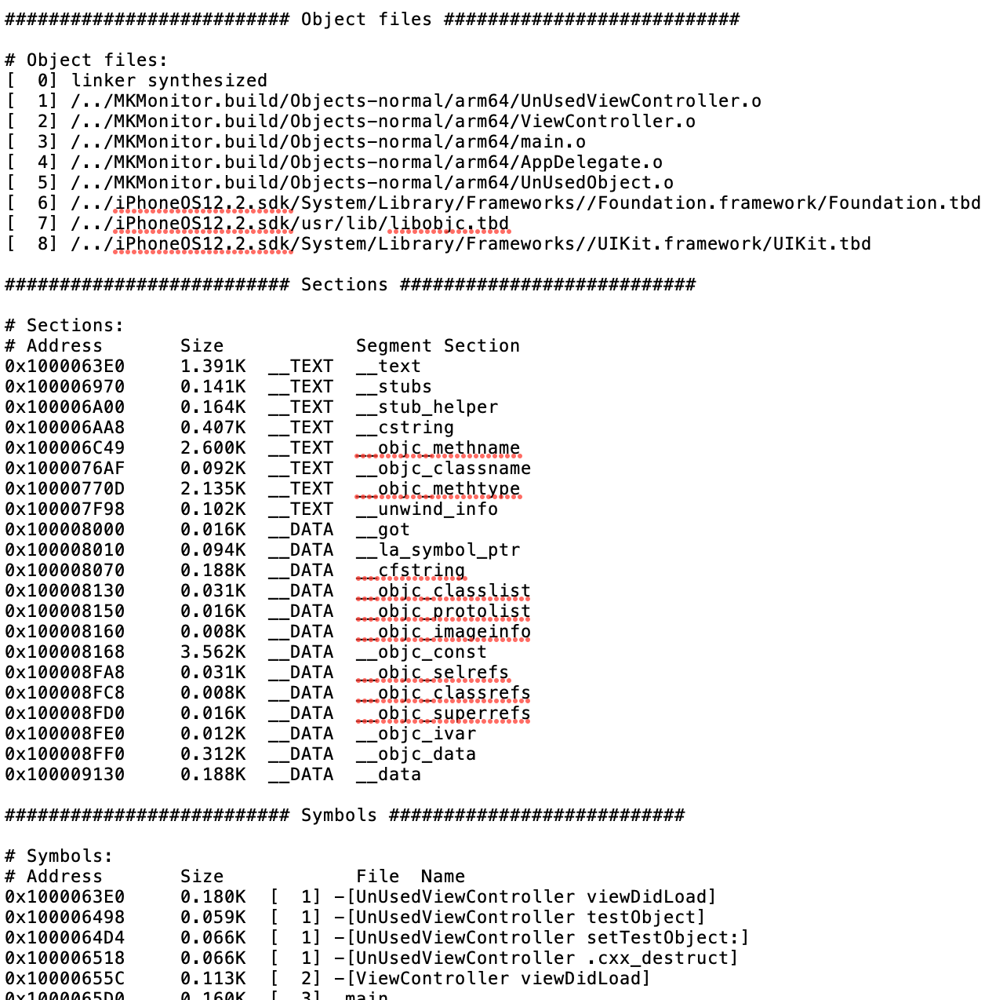

- [MacApp](./macApp): 提高工作效率而写的 Mac 小工具
- [Swift  开发](./swift)
- [Script](./script) ：常用的脚本工具
- [Runtime](./runtime)
- -  [Mach-O Runtime Architecture](./runtime/Mach-ORuntimeArchitecture.pdf)
- -  [Dynamic Library Programming Topics](./runtime/DynamicLibraryProgrammingTopics.pdf)

*** Mac App
------
___

### 1. MKLinkMap : iOS Link Map 文件分析工具,实现了统计代码使用情况及大小等功能。

//支持 xcarchive 文件和 dSYM 文件。

### [PKG安装文件下载地址](https://github.com/mythkiven/mkBox/releases/tag/V1.0.0)

1. 解析 Link Map 文件：

2. 搜索功能：

3. 按库分析：

4. 格式化输出 : 输出经过处理后易于阅读的  Link Map 文件 (文件过大时，输出可能需要几分钟时间)

5. 输出文件：输出经统计后的 Link Map 文件

> 下一个功能预告：添加__dYSM 解析
