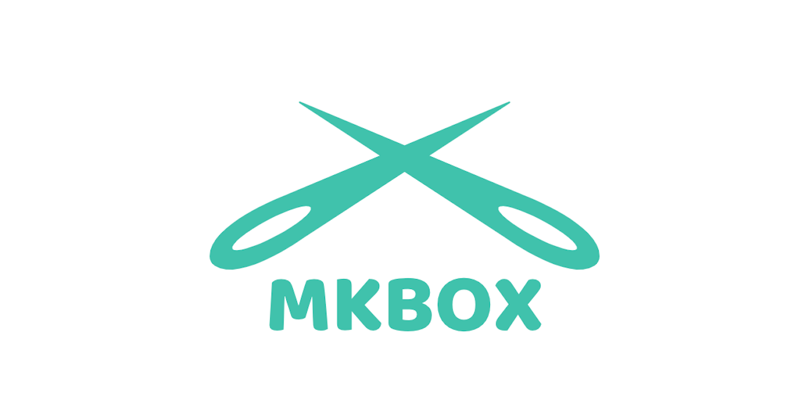

# mkBox | macOS & iOS Developer Toolbox

Collection of Mac apps, Python packages, and scripts for iOS/macOS developers: [MKAppTool](https://github.com/mythkiven/mkBox/releases/tag/MKAppTool) (dSYM / xcarchive / LinkMap analysis), [mkTranslate](https://github.com/mythkiven/mkTranslate), [mkAppleOpenSourceDownload](https://github.com/mythkiven/mkAppleOpenSourceDownload), runtime docs, and utilities.

Keywords: dsym analyzer mac, linkmap analysis, ios crash tools, macos devtools, xcode utilities

## Quick Start

Download [MKAppTool.pkg](https://github.com/mythkiven/mkBox/releases/download/MKAppTool/MKAppTool.pkg) for crash symbolication and LinkMap size analysis.

Browse all releases: [mkBox Releases](https://github.com/mythkiven/mkBox/releases).

### MKAppTool.pkg install blocked on macOS?

If macOS says the package is damaged or should be moved to Trash (common on 10.14–10.15 with unsigned builds):

1. **Right-click → Open** the `.pkg`, then confirm **Open**
2. Or remove quarantine: `xattr -cr ~/Downloads/MKAppTool.pkg && open ~/Downloads/MKAppTool.pkg`
3. Or build from source: [MKAppTool](https://github.com/mythkiven/MKAppTool) / clone this repo and open the Xcode project under `macApp`

See [scripts/install-mkapptool.sh](./scripts/install-mkapptool.sh) for a one-liner helper.

**Note:** MKAppTool runs on macOS 10.14+.

- [Runtime](./runtime): Mach-O and dynamic library notes
- [MacApp](./macApp/README.md): Includes analysis tools such as [MKAppTool](https://github.com/mythkiven/mkBox/releases/tag/MKAppTool)
- [Swift](./swift)
- [Script](./script) : Contains common scripting tools such as [mkTranslate](https://github.com/mythkiven/mkTranslate)
- [Runtime](./runtime)
- -  [Mach-O Runtime Architecture](./runtime/Mach-ORuntimeArchitecture.pdf)
- -  [Dynamic Library Programming Topics](./runtime/DynamicLibraryProgrammingTopics.pdf)

### MacApp

| App | Des | Remark |
| --- | --- | --- |
| [MKAppTool](https://github.com/mythkiven/mkBox/releases/tag/MKAppTool) | Analysis tools for .dSYM files, .xcarchive files, and Link Map files | - |
|  |  |  |

### Script

| Script | Des | Remark |
| --- | --- | --- |
| [mkTranslate](https://github.com/mythkiven/mkTranslate) | Analysis tools for .dSYM files, .xcarchive files, and Link Map files | - |
| [mkAppleOpenSourceDownload](https://github.com/mythkiven/mkAppleOpenSourceDownload) |  Can search and download the source code on "opensource.apple.com" based on keywords | support for fuzzy matching |
| | | |

### 小程序

实用性小工具，主要功能:
- 1、搜索垃圾种类、拍照识别垃圾、上传新的垃圾数据，垃圾分类贡献榜；
- 2、AI颜值分析、AI识别物体；
- 3、AI智能闲聊；
- 4、搜索附近；
- 5、单词查询等功能。
[更多戳这里](./js/README.md)

扫码体验

*** Mac App
------
___

### 1. MKAppTool : .dSYM 文件、.xcarchive 文件和 Link Map 文件的分析工具

### [PKG 安装文件下载地址](https://github.com/mythkiven/mkBox/releases/tag/MKAppTool)
目前升级到 2.0 版本，在 1.0 版本 linkmap 文件分析的基础之上，支持 dSYM 和. xcarchive 文件的分析。

下一步，将优化大文件分析和增强分析功能。

### 1、dSYM 文件分析：实现根据错误地址进行代码定位等功能

打开本工具，会自动检索本地的 .xcarchive 文件。然后可进行详细的错误定位，从而找到 crash 点。

### 2、LinkMap 文件分析：实现统计代码使用情况及大小等功能。

1. 在 XCode 中开启编译选项 Write Link Map File : XCode -> Project -> Build Settings ->  Write Link Map File 设为 yes，并指定好 linkMap 的存储位置

2. 工程编译完成后，在指定的位置找到 Link Map 文件（默认名称:$(PRODUCT_NAME)-LinkMap-$(CURRENT_VARIANT)-$(CURRENT_ARCH).txt）
默认的文件地址：~/Library/Developer/Xcode/DerivedData/xxxxxxxxxxxx/Build/Intermediates/XXX.build/Debug-iphoneos/XXX.build/

支持按关键字搜索、按库分组统计。

